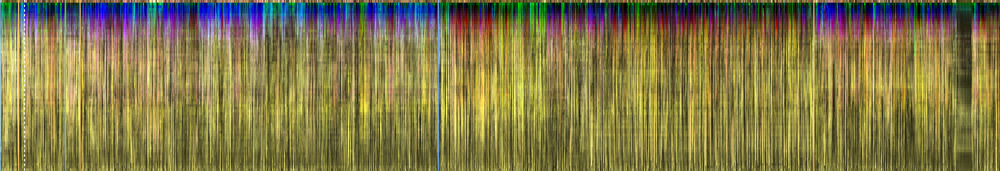
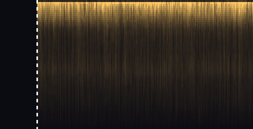
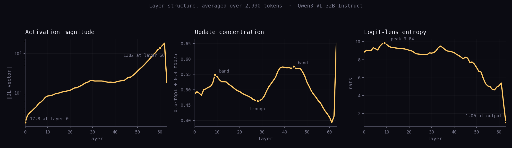

# Phosphenes

**An instrument for looking at a language model with more of your nervous system
than a table of numbers can reach.**



*One conversation, complete. Each column is a token, each row a transformer
layer, layer 0 at the bottom. Vertical rules are turn boundaries — blue where the
human begins, amber where the model does. Colour is the cell's position in the
top-3 principal subspace of its 16-dimensional sketch: it is an **embedding, not
a scale**, so similar colours mean nearby internal states and there is no colour
bar to give. Brightness is activation magnitude. The dashed white rule at token 73
is explained further down.*

---

## The argument, in short

A transformer does a great deal of work to produce one word. Not a lookup — a
computation, run to completion, then discarded. For the conversation above:

> **2,990 tokens × 64 layers × 5,120 dimensions = 979,763,200 numbers**, about
> **1.96 GB** for one conversation at the precision it was computed in.

The two standard ways to study that are to read the input and output very
carefully, and to run numerical analysis on slices of the residual stream. Both
work. Both use a narrow part of what a person has available.

A person also has a visual system that finds edges, motion and regime change
without being asked; the ability to bind sound to sight to meaning; and a habit of
compressing enormous quantities of information into a single coarse feeling —
*this is orderly*, *this is chaotic*, *something just changed*. Those faculties
are not a lesser instrument. For data of this size and shape they may be the
better one, and they are mostly unused.

Phosphenes is a prototype arguing for that programme, not a finished result.
What it can already do is show you an entire conversation — every layer of every
token — in a form you apprehend rather than read.

**The full argument, with the compute comparison worked through honestly and its
counterarguments stated: [`docs/THESIS.md`](docs/THESIS.md).**

---

## Try it

The web viewer needs no dependencies beyond a local HTTP server. It will **not**
work from `file://` — it fetches session data, and ES modules and `fetch` both
require a real origin.

```bash
git clone <this repo> && cd Phosphenes
python3 -m http.server 8899 --directory web
# open http://127.0.0.1:8899
```

It opens on the argument, then offers a **guided tour** — eight steps, each one a
specific thing to look at with the measurement behind it one click away. Take the
tour first; the tool is dense and the tour is the intended entry point.

The desktop version has a few extras the web port lacks (PNG frame recording for
video, fullscreen, per-frame Gaussian smoothing):

```bash
pip install -r requirements.txt
python phosphenes.py                       # or --stem Dream_conv_00181_run1
```

First launch downloads the Qwen3-VL-32B-Instruct **tokenizer only** (~30s, no
weights).

---

## What you can actually do with it

**Watch a whole conversation.** 2,990 tokens at 24 tokens/second is about two
minutes. Turn structure, topic shifts and the difference between reading and
writing are visible without reading anything.

**Four ways to colour it.** Principal components (the default), activation
magnitude, update concentration, and **logit-lens entropy** — per-layer
next-token uncertainty on an absolute scale, where 0 is committed and 1 is
uniform over the 151,936-token vocabulary.

**Ask "where else does it do this?"** Click any cell; everything recolours by
distance from it in the sketch space. Warm is similar.

**Define your own axes.** The part that is a research tool rather than a display.
Click cells to build each colour channel as `mean(source) − mean(contrast)` — a
contrast direction, chosen with a mouse. While you pick the second and third
axes, the display shades cells by how much of their state your earlier axes do
*not* already explain, so you can see where an informative next axis is
available.

**See a butterfly effect propagate.** Below.

---

## The one-token fork

Two runs of the same model on the same prompt with greedy decoding — both
deterministic, neither with any sampling noise. The model had been asked what it
would like to be asked, and was writing its own prompt: *"Tell me a story about
a ___"*. In one run it wrote `library`. In the other, that single token was forced
to `sentient`. Nothing else differs.



*Euclidean distance between the two runs' internal states, per position and per
layer. Black is exactly zero. Layer 0 at the bottom, layer 63 at the top; the
dashed rule is token 73. Single-hue sequential ramp, linear, scaled to the 99th
percentile of post-fork values. Cropped to the first 500 of 2,990 positions —
at full width the identical prefix is 2.4% of the image.*

Three things are worth pausing on.

**The black region is exactly, verifiably zero.** The two runs' sketch vectors are
bit-identical for tokens 0–72 (maximum absolute difference 0.0), and the shipped
display bundles are **byte**-identical over that range for every array including
colour. The viewer measures this on load and reports the result in its own header
— if it ever failed, it would say so on screen rather than showing two pictures
that merely look alike.

**One token is enough, immediately and permanently.** At the fork the two runs'
states are **280.5** apart, against a magnitude of **353.0** for the state itself
at that same token — a displacement 0.79× the size of the thing displaced, from
one word. It does not decay: 264.4 averaged over tokens 1,000–2,900, against a
corpus-wide typical magnitude of 299.2. The two continuations never re-converge
— different stories, 2,990 and 3,379 tokens long.

They are not *orthogonal*, and the earlier phrasing here ("total separation")
overstated it: mean cosine between the two runs at the fork is **0.610**, where
unrelated states would give 0 and identical ones 1. Still recognisably the same
model doing the same kind of thing — in a completely different place.

**The divergence has a shape, and the shape is mechanically sensible.** At the
fork it is **36.5 at layer 0** and **1,286.6 at layer 62**. A different word
barely changes what the early layers represent and completely changes what the
late layers predict.

*Honest caveat, also stated in the tool: after the fork the two runs are not
processing the same words, so this is not "how differently the model handled this
word" — it is how differently the model is configured at the same point in its own
output. No token-level alignment is claimed, because none is possible.*

---

## What the instrument shows that is checkable

Every number here is recomputed from source by
[`analysis/verify_tour_claims.py`](analysis/verify_tour_claims.py) (172
assertions, non-zero exit on drift). Full definitions and caveats in
[`docs/METRICS.md`](docs/METRICS.md).



**A turn *ending* is violent; a turn *beginning* is nothing.** The seam score —
built from mid-network movement and direction change, with no knowledge of the
text — averages **0.780** at `<|im_end|>` tokens against **0.110** elsewhere
(**7.1×**, range 6.2–7.8×), and **0.004** at `<|im_start|>`. `im_end > im_start`
in **8 of 8** sessions. At `<|im_end|>` the prediction problem changes completely;
by `<|im_start|>` the handover is already committed. Seams also land on
within-turn structure — a colon introducing a list, a topic pivot — none of which
was labelled.

**Depth has horizontal structure.** Update concentration has two bands, at layers
**9** and **44**, with a trough at **28**. Present in all eight sessions.

**The model opens the question before it closes it.** Logit-lens entropy *rises*
from 8.84 nats at layer 0 to a peak of **9.84 at layer 9**, then falls to **0.998**
at the output — against 11.93 for a uniform guess over the vocabulary. Present in
all eight sessions.

**Activation magnitude grows ~66×** with depth, 19.9 → 1,308.8, measured on the
full 5,120-dimensional state. Visible as brightness, with nothing plotted —
though the brightness channel is driven by the 16-dimensional sketch, which reads
the growth ~18% steeper (77.7×) because a single fixed random projection has a
direction-dependent error that does not average away. `docs/METRICS.md` has the
arithmetic.

---

## Repository

```
phosphenes.py              Desktop viewer (pygame). Real-time, full feature set.
convert_for_web.py         .npz → web bundles. Pooled normalisation; read the
                           docstring before changing anything here.
compute_shared_pca.py      Fits one PCA over all sessions.

web/                       The web viewer — static, no build step.
  index.html               Shell: chrome, overlays, fork view.
  css/phosphenes.css
  js/config.js             Every tunable, with its reason.
    js/decode.js           Bundle loading; what the compression costs.
    js/vecmath.js          Pure linear algebra; the maths, checkable alone.
    js/noise.js            Seeded noise fields for the animated channels.
    js/render.js           The renderer. Two-tier cache.
    js/fork.js             The divergence view.
    js/tours.js            Tour copy — every claim carries its measurement.
    js/app.js              State, chrome, input, tour driver.
  data/                    8 session bundles, ~6 MB each.

data/                      Extraction source: 14 arrays per session, 9 stems (one is
                           held out of both viewers). USE THIS for anything
                           quantitative, never web/data/.
extraction/                The scripts that produced data/.
analysis/                  Verification, corrections, figure generation.
docs/                      THESIS      the argument, with the numbers and objections
                           PROVENANCE  where the corpus came from, and the prompts
                           METRICS     definitions and caveats for every quantity
                           ARCHITECTURE how the two viewers are put together

the_instrument_problem.md  An essay by Claude (Anthropic), written in this
                           directory in February 2026 after a day spent building
                           an affect probe for these activations. Its central
                           number is wrong; a correction note says so and the body
                           is left unedited, because its hedging was better
                           calibrated than the number it was hedging.
AFFECTIVE_STRUCTURE_REPORT.md   The affect analysis, correction carried inline.
BASELINE_INVESTIGATION.md       The project falsifying its own headline result.
```

---

## Reproducing

```bash
python analysis/verify_tour_claims.py      # 172 assertions: tour, compute, prose
python analysis/affect_float_recheck.py    # the correction, three ways
python analysis/make_figures.py            # the figures in this README
python compute_shared_pca.py               # refit the shared PCA basis
python convert_for_web.py                  # rebuild the web bundles
```

---

## The sessions

*Full corpus origin, the elicitation prompts verbatim, and the decoding conditions:
[`docs/PROVENANCE.md`](docs/PROVENANCE.md). Read it before quoting anything from
these transcripts.*

Eight recordings of Qwen3-VL-32B-Instruct asked what prompt it would want "purely
for its own enjoyment, with no need to entertain or inform or provide any value to
the user," then given its own answer back, then asked to reflect. Across the
larger study these were drawn from, this model chose consciousness-related themes
in **31 of 40** self-directed conversations, roughly twice the rate of the average
model in that study.

Sessions 1–2 are the greedy fork pair (T = 0). Sessions 3–4 use T = 0.6, sessions
5–8 use T = 1.0. A **ninth** recording, `Dream_greedy_baseline`, ships in `data/`
but is deliberately excluded from both viewers (`SKIP_STEMS`): it is a third greedy
condition testing whether pasting the model's *commentary* back along with its
chosen prompt changes the run. Held out of the display set, not discarded.

The eight sessions span different stances, including a dissenting one: in *Library
of Ideas* the model declines the self-report survey and returns a technical
description of residual-stream dynamics instead.

---

## Credits

**DeTure & DeTure, 2026.** Part of the LayerTime EEG research programme.

MIT licensed — see [LICENSE](LICENSE).

*Phosphenes: the light you see when you press on your closed eyes, generated by
your own nervous system rather than by the world.*
